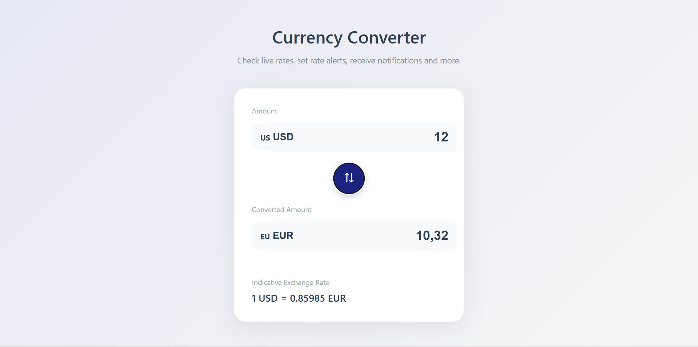

# 💱 SwiftX — Currency Converter

Простой, лёгкий и быстрый конвертер валют в реальном времени.  
Проект написан на **чистом JavaScript**, без библиотек, и использует API [Frankfurter](https://www.frankfurter.app/) для получения актуальных валютных курсов.

---

## 🚀 Возможности

- 🔄 Мгновенная конвертация при вводе значения  
- 💰 Поддержка популярных валют (USD, EUR, GBP, JPY, RUB, SGD и др.)  
- ↕️ Переключение валют одной кнопкой  
- 📡 Автоматическое обновление курса из открытого API  
- 🧠 Минималистичная и понятная логика кода  

---

## 🧩 Технологии

- **HTML5**
- **CSS3**
- **Vanilla JavaScript (ES6+)**
- **Frankfurter API**

---

## 🖼️ Скриншот интерфейса

*(примерный макет)*  


---

## ⚙️ Установка и запуск

1. Склонируй репозиторий:
  
   ```bash
   git clone https://github.com/твоя-ссылка-на-репозиторий.git
   
   # Переходим в директорию проекта
   cd swiftx-currency-converter

   # Открываем в браузере
   index.html
   
   (Сервер не обязателен — всё работает локально!)
   ```
   
🛠️ API Источник

Проект использует Frankfurter API
 — бесплатный сервис для получения обменных курсов в режиме реального времени.

Пример запроса: 
```bash
GET https://api.frankfurter.app/latest?base=USD&symbols=EUR
```

👨‍💻 Автор

Exmar — Fullstack Developer

📧 Telegram: @Exmar1
